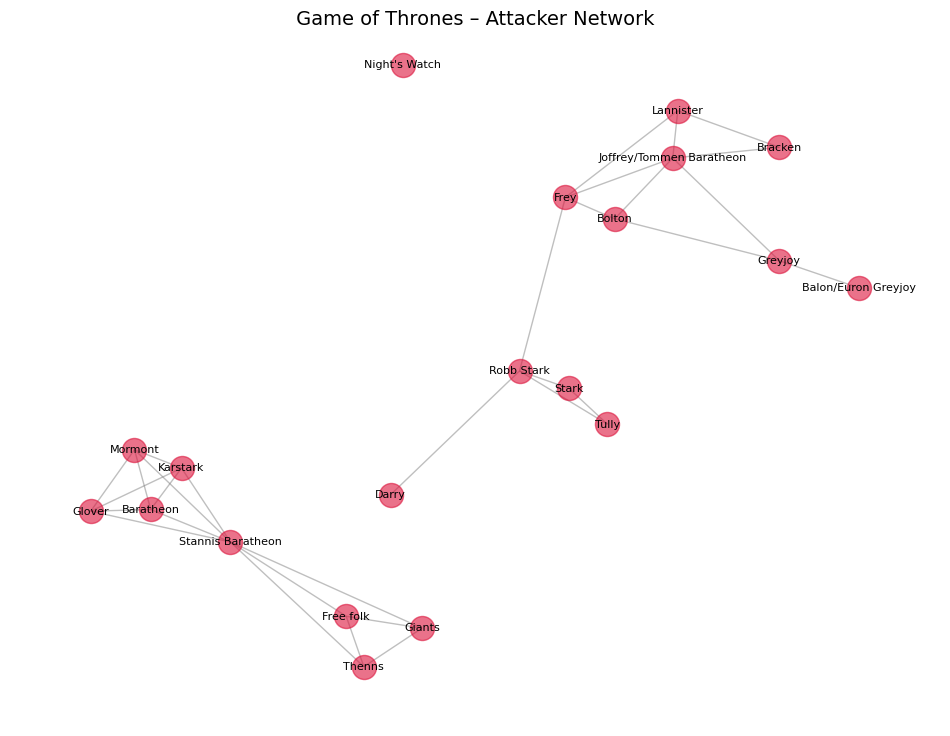
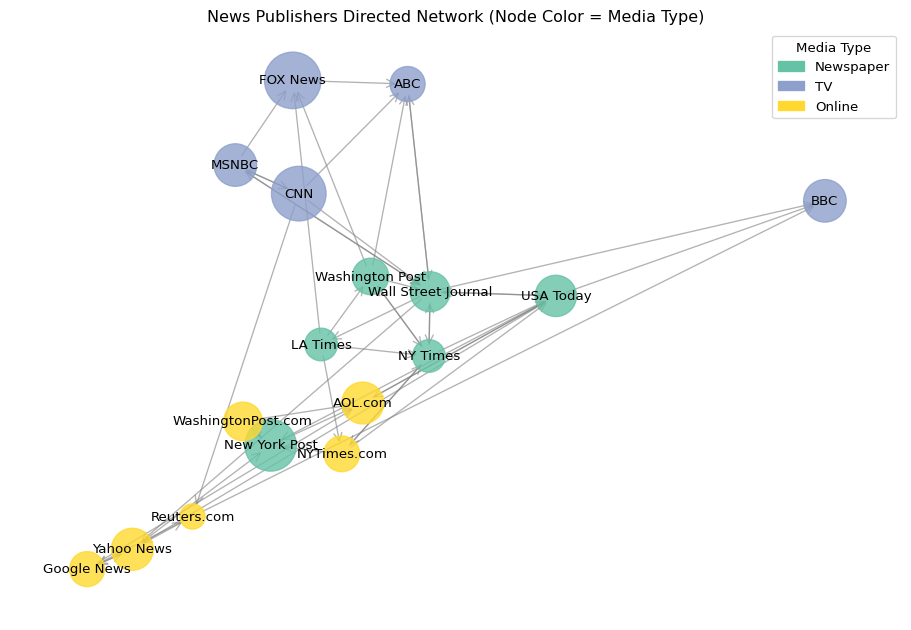

Data620

This repository contains coursework and projects for Data 620. The focus is on using Python to conduct network analysis, including work with centrality measures, projected graphs, and weighted networks.

Data sets explore relationships in novels like the Song of Ice and Fire By George RR Martin for clique and revelations in battles:

Additionally, the repository explores various NLP tasks such as sentiment analysis and document classification.
The primary libraries used include scikit-learn and NetworkX.

All code is written in Jupyter notebooks to ensure clarity, transparency, and reproducibility.
